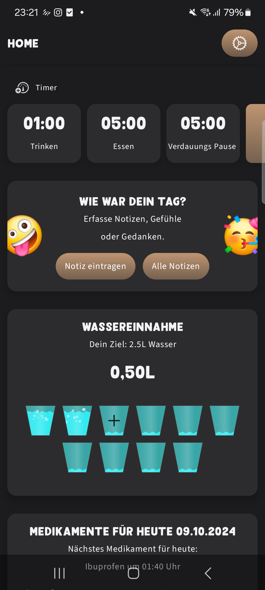

[](https://play.google.com/store/apps/details?id=de.frederikkohler.bauchglueck)

# BauchGlück
 "**BauchGlück** ist eine speziell entwickelte App für Menschen nach einer **Magenbypass-Operation**. Sie vereint Ernährung, Medikation und Wohlbefinden in einer intuitiven Plattform und unterstützt Nutzer dabei, ihren Alltag zu organisieren und ihre Gesundheit im Blick zu behalten."

Die App bietet hilfreiche Tools wie Countdown-Timer zur Erinnerung an Ess- und Trinkzeiten, dokumentiert die Wasseraufnahme und den Gewichtsverlauf, verwaltet Medikamente und erinnert an die Einnahme. Zudem ermöglicht sie die einfache Planung von Mahlzeiten. Eine integrierte Community-Funktion fördert den Austausch von Rezepten unter den Nutzern.

## UX/UI
> [Figma Case Study](https://www.figma.com/design/FMorQUMx5iu7ysW2AuTS1x/Project-MagenApp?node-id=40-29&t=7M0qex8nEc9LTMWf-1)

> [Figma UX/UI Design](https://www.figma.com/design/FMorQUMx5iu7ysW2AuTS1x/Project-MagenApp?node-id=40-29&t=7M0qex8nEc9LTMWf-1)

> [Figma Pitch Presentation](./images/presentation_bauch_glueck_compressed.pdf)


## App Design
<p>
    
    
    
</p>

<p>
    
    
    
</p>

## Features
- [x] Verwaltung und Erstellung von Countdown-Timern mit Benachrichtigungen (z.B. für Ess- und Trinkzeiten)
- [x] Dokumentation und Anzeige des Gewichtsverlaufs
- [x] Eingabe und Nachverfolgung der täglichen Wasseraufnahme
- [x] Verwaltung und Erstellung von Rezepten
- [x] Verwaltung von Medikamenten mit Verfolgung der Einnahmezeiten
- [x] Planung und Verwaltung von Mahlzeitenplänen
- [x] Erstellung und Verwaltung von Einkaufslisten
- [x] Einstellungen zur Personalisierung der App und rechtliche Hinweise

## Technischer Aufbau

#### Projektaufbau
Die Projektstruktur basiert auf dem MVVM (Model-View-ViewModel) Muster auf der Client-Seite und einem Repository-Ansatz im Backend, das in Kotlin geschrieben ist. Das Backend bedient eine API und nutzt verschiedene Services für die Datenverarbeitung und Speicherung.

- app/ enthält die Android-App (MVVM).
- server/ enthält den Server-Code, geschrieben in Kotlin, der für die API und Datenverarbeitung verantwortlich ist.


#### Datenspeicherung
Die Datenspeicherung erfolgt über eine Kombination aus:

- Room Database für die lokale Speicherung in der App.
- Firebase für Authentifizierung und Cloud-Speicherung.
- Strapi Backend speichert Daten in einer relationalen Datenbank.

#### API Calls
Es werden APIs für Rezeptmanagement und Benutzerdaten verwendet. Die wichtigsten API-Endpunkte im Backend sind:

- /api/water-intake/fetchItemsAfterTimeStamp?timeStamp={timestamp}&userId={userID}
- /api/recipes/getUpdatedRecipesEntries?timeStamp={timestamp}
- /api/weight/fetchItemsAfterTimeStamp?timeStamp={timestamp}&userId={userID}
- /api/medication/getUpdatedMedicationEntries?timeStamp={timestamp}&userId={userID}
- /api/timer/fetchItemsAfterTimeStamp?timeStamp={timestamp}&userId={userID}
- /api/mealPlan/getUpdatedMealPlanDayEntries?timeStamp={timestamp}&userId={userID}
- /api/recipes/generateRecipe?category={RecipeKind}
- /api/meal/getUpdatedMealEntries?timeStamp={timestamp}
- /api/water-intake/updateRemoteData
- /api/weight/updateRemoteData
- /api/medication/syncDeviceMedicationData
- /api/timer/updateRemoteData
- /api/send-schedule-notification
- /api/upload/
- /api/appStatistics

#### Dependencies
Es ist eine gute Praxis, die verwendeten Dependencies aufzulisten. Das gibt den Nutzern deines Projekts eine klare Vorstellung davon, was im Projekt verwendet wird.
- Room 2.3.0 – Für lokale Datenbankverwaltung.
- Ktor Client – Für Netzwerkoperationen.
- Coil - Für Ayncrone Image loading und Cashing.
- Koin - für Dependency Injection
- Firebase – Für Authentifizierung und Cloud-Speicherung.


## Backend (Strapi)
The backend for this project, built with Strapi, is available in the following repository:

Repository: https://github.com/ChromeSD22159/BauchGueckStrapiBackend
Please refer to the repository's README for instructions on how to set up and run the Strapi backend server.

Important: Make sure the `API_HOST` in your local.properties configuration in your Kotlin code matches the actual URL of your running Strapi instance.

## Configuration

To ensure the application runs correctly, you need to configure both the `API_KEY` and `API_HOST` in your `local.properties` file.

### Steps for Configuration:

1. **Obtain the API Key:**
  - Log in to your Strapi dashboard.
  - Navigate to the API Token settings and copy the required API Key.

2. **Set the API Key in `local.properties`:**
  - Open the `local.properties` file in your project directory.
  - Add or update the following entry:

    ```properties
    API_KEY=<YOUR_API_KEY>
    ```

  - Replace `<YOUR_API_KEY>` with the API Key you obtained from Strapi.

3. **Configure the API Host:**
  - In the same `local.properties` file, add or update the `API_HOST` entry to match the URL of your running Strapi instance:

    ```properties
    API_HOST=<YOUR_API_HOST>
    ```

  - Replace `<YOUR_API_HOST>` with the actual URL of your Strapi instance (e.g., `http://localhost:1337`).

4. **Save and Restart:**
  - Save the `local.properties` file.
  - Restart the application to apply the changes.

These configurations ensure that the application can correctly interact with your Strapi API.